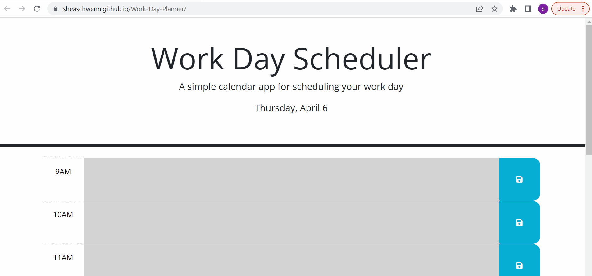

# Work-Day-Planner
A web planner that will store a users schedule by the hour

## Technology Used 

| Technology Used         | Resource URL           | 
| ------------- |:-------------:| 
| HTML    | [https://developer.mozilla.org/en-US/docs/Web/HTML](https://developer.mozilla.org/en-US/docs/Web/HTML) | 
| CSS     | [https://developer.mozilla.org/en-US/docs/Web/CSS](https://developer.mozilla.org/en-US/docs/Web/CSS)      |   
| Git | [https://git-scm.com/](https://git-scm.com/)     |    
|JavaScript | [https://developer.mozilla.org/en-US/docs/Web/JavaScript](https://developer.mozilla.org/en-US/docs/Web/JavaScript) |
|jQuery | [https://jquery.com/](https://jquery.com/) |
|Day.js | [https://day.js.org/](https://day.js.org/) |

## Description 

[Visit the Work Day Planner](https://sheaschwenn.github.io/Work-Day-Planner/)

An hourly work day planner where users can save their schedule to come back to later. Information written in the time blocks, if saved, will persist after the page has been reloaded.  The date at the top to match the current date and each day the time blocks will change styling depending on if the hour is passed, currently happening, or in the future. 





## Table of Contents 

* [jQuery Example](#jquery-example)
* [Usage](#usage)
* [Learning Points](#learning-points)
* [Author Info](#author-info)
* [Credits](#credits)
* [License](#license)


## jQuery Example

Function that iterates through each element with the class time block to compare the current hour with each element unique id. 
The method substring() was used to extract just the hour that had be assigned to each time block element.  This hour was then parsed into an integer.  A series of if statements then assign a class to each element so that the user can see which hour are in the past,present, and future. 

```js
 function hourClass() {
    
    timeBlock.each(function () {
      
      var timeHour = parseInt($(this).attr("id").substring(5))
      
      if (timeHour === hour) {
        console.log(timeHour)
        $(this).addClass("present")
      }
      else if (hour > timeHour) {
        $(this).addClass("past")
      }
      else {
        $(this).addClass("future")
      }
    })

  }
```


## Usage 

This work day planner can be used to save tasks by the hour that the user can then come back and referance throughout the day. 


## Learning Points 
This project was my first real introduction to jQuery and using the key word this. I also got the chance to explore the day.js library.
* jQuery

* The key work this

* more on local storage 

* day.js


## Author Info


### Shea Schwennicke  


* [Portfolio](https://sheaschwenn.github.io/Portfolio/)
* [LinkedIn](https://www.linkedin.com/in/shea-schwennicke-76a378210/)
* [Github](https://github.com/sheaschwenn)


## License

MIT License

For more information please refer to the LICENSE in the repo.


---

© 2023 edX Boot Camps LLC. Confidential and Proprietary. All Rights Reserved.